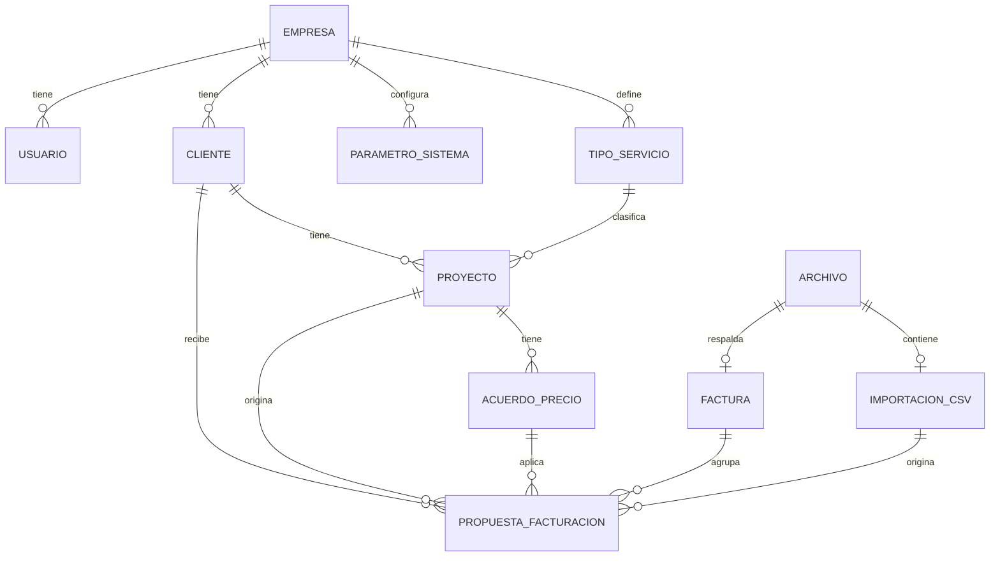

# Modelo de Datos

**Proyecto:** Sistema de Facturación Recurrente de Proyectos
**Cliente inicial:** Helpcom Ltda.
**Etapa:** 1 — Arquitectura
**Estado del documento:** Borrador para revisión
**Última actualización:** 2026-08-05
**Motor:** PostgreSQL 16 · Migraciones: Flyway

---

## 1. Propósito

Este documento define el modelo de datos de la Etapa 1: entidades, relaciones, tipos, restricciones, reglas de cálculo de la facturación y la especificación del archivo CSV de importación. Es la fuente autoritativa para las migraciones Flyway y el mapeo JPA. Debe leerse junto al documento de *Arquitectura Técnica*.

---

## 2. Convenciones del modelo

### 2.1 Nombres
- Tablas y columnas en **español**, `snake_case`, tablas en **singular** (`cliente`, `proyecto`, `acuerdo_precio`).
- Claves foráneas: `<entidad>_id` (`cliente_id`, `proyecto_id`).
- Índices: `ix_<tabla>_<columnas>`; únicos: `uq_<tabla>_<columnas>`; checks: `ck_<tabla>_<detalle>`; exclusión: `ex_<tabla>_<detalle>`.

### 2.2 Claves primarias
- Todas las tablas usan `id BIGINT GENERATED BY DEFAULT AS IDENTITY PRIMARY KEY`, salvo `valor_uf` que usa la fecha como clave natural.

### 2.3 Tipos de datos
| Uso | Tipo | Nota |
|---|---|---|
| Dinero en UF (con decimales) | `NUMERIC(18,4)` | La UF admite decimales (p. ej. 12,5 UF). |
| Dinero en CLP (entero) | `NUMERIC(18,0)` | El peso chileno no tiene decimales. |
| Valor de la UF | `NUMERIC(12,4)` | CLP por 1 UF (p. ej. 40844,7900). |
| Porcentaje | `NUMERIC(7,4)` | Descuento porcentual (p. ej. 10,0000). |
| Tasa IVA | `NUMERIC(6,4)` | Parametrizable (p. ej. 0,1900). |
| Fechas | `DATE` | |
| Marcas de tiempo | `TIMESTAMPTZ` | Con zona horaria. |
| Enumerados | `VARCHAR(n)` + `CHECK` | Valores en español, MAYÚSCULAS. |

### 2.4 Columnas de auditoría
Todas las tablas de negocio incluyen:
```sql
creado_por      VARCHAR(120) NOT NULL,
creado_en       TIMESTAMPTZ  NOT NULL DEFAULT now(),
modificado_por  VARCHAR(120),
modificado_en   TIMESTAMPTZ
```
`creado_por` / `modificado_por` guardan el identificador del usuario (subject o email del token OIDC).

### 2.5 Preparación multi-tenant
Toda tabla de negocio incluye `empresa_id BIGINT NOT NULL REFERENCES empresa(id)`. Hoy siempre apunta a Helpcom; no se filtra aún, pero **jamás** debe quedar nula. La tabla global `valor_uf` es la única excepción: el valor de la UF es nacional, no depende de la empresa.

---

## 3. Diagrama entidad-relación



`VALOR_UF` no tiene relación por clave foránea: la propuesta guarda el valor UF usado como parte de su *snapshot* (referencia por fecha).

---

## 4. Catálogo de entidades

### 4.1 `empresa`
Empresa dueña de los datos. Habilita el futuro multi-tenant.
```sql
CREATE TABLE empresa (
  id               BIGINT GENERATED BY DEFAULT AS IDENTITY PRIMARY KEY,
  rut              VARCHAR(12)  NOT NULL,
  razon_social     VARCHAR(200) NOT NULL,
  nombre_fantasia  VARCHAR(200),
  activa           BOOLEAN NOT NULL DEFAULT TRUE,
  creado_por       VARCHAR(120) NOT NULL,
  creado_en        TIMESTAMPTZ  NOT NULL DEFAULT now(),
  modificado_por   VARCHAR(120),
  modificado_en    TIMESTAMPTZ,
  CONSTRAINT uq_empresa_rut UNIQUE (rut)
);
```

### 4.2 `usuario`
Espejo local de los usuarios de Keycloak, para auditoría y administración. **La fuente de verdad de la autenticación y los roles es Keycloak**; esta tabla es de apoyo.
```sql
CREATE TABLE usuario (
  id             BIGINT GENERATED BY DEFAULT AS IDENTITY PRIMARY KEY,
  empresa_id     BIGINT NOT NULL REFERENCES empresa(id),
  sub_oidc       VARCHAR(100) NOT NULL,
  email          VARCHAR(150) NOT NULL,
  nombre         VARCHAR(150) NOT NULL,
  rol            VARCHAR(20)  NOT NULL,
  activo         BOOLEAN NOT NULL DEFAULT TRUE,
  creado_por     VARCHAR(120) NOT NULL,
  creado_en      TIMESTAMPTZ  NOT NULL DEFAULT now(),
  modificado_por VARCHAR(120),
  modificado_en  TIMESTAMPTZ,
  CONSTRAINT uq_usuario_sub UNIQUE (sub_oidc),
  CONSTRAINT ck_usuario_rol CHECK (rol IN ('ADMINISTRADOR','OPERADOR'))
);
```

### 4.3 `parametro_sistema`
Configuración parametrizable por empresa. Aquí vive la **tasa de IVA**.
```sql
CREATE TABLE parametro_sistema (
  id             BIGINT GENERATED BY DEFAULT AS IDENTITY PRIMARY KEY,
  empresa_id     BIGINT NOT NULL REFERENCES empresa(id),
  clave          VARCHAR(60)  NOT NULL,
  valor          VARCHAR(200) NOT NULL,
  descripcion    VARCHAR(300),
  creado_por     VARCHAR(120) NOT NULL,
  creado_en      TIMESTAMPTZ  NOT NULL DEFAULT now(),
  modificado_por VARCHAR(120),
  modificado_en  TIMESTAMPTZ,
  CONSTRAINT uq_parametro UNIQUE (empresa_id, clave)
);
```

### 4.4 `tipo_servicio` (catálogo opcional)
Clasificación del servicio de un proyecto, para informes. Opcional.
```sql
CREATE TABLE tipo_servicio (
  id             BIGINT GENERATED BY DEFAULT AS IDENTITY PRIMARY KEY,
  empresa_id     BIGINT NOT NULL REFERENCES empresa(id),
  nombre         VARCHAR(120) NOT NULL,
  activo         BOOLEAN NOT NULL DEFAULT TRUE,
  creado_por     VARCHAR(120) NOT NULL,
  creado_en      TIMESTAMPTZ  NOT NULL DEFAULT now(),
  modificado_por VARCHAR(120),
  modificado_en  TIMESTAMPTZ,
  CONSTRAINT uq_tipo_servicio UNIQUE (empresa_id, nombre)
);
```

### 4.5 `cliente`
```sql
CREATE TABLE cliente (
  id              BIGINT GENERATED BY DEFAULT AS IDENTITY PRIMARY KEY,
  empresa_id      BIGINT NOT NULL REFERENCES empresa(id),
  rut             VARCHAR(12)  NOT NULL,
  razon_social    VARCHAR(200) NOT NULL,
  nombre_fantasia VARCHAR(200),
  giro            VARCHAR(150),
  email           VARCHAR(150),
  telefono        VARCHAR(30),
  direccion       VARCHAR(250),
  activo          BOOLEAN NOT NULL DEFAULT TRUE,
  creado_por      VARCHAR(120) NOT NULL,
  creado_en       TIMESTAMPTZ  NOT NULL DEFAULT now(),
  modificado_por  VARCHAR(120),
  modificado_en   TIMESTAMPTZ,
  CONSTRAINT uq_cliente_rut UNIQUE (empresa_id, rut)
);
```

### 4.6 `proyecto`
Un proyecto tiene **un solo servicio**: el precio, la moneda, la periodicidad y el día de facturación viven aquí. `precio_base_neto` es siempre **neto** y está expresado en `moneda_precio`.
```sql
CREATE TABLE proyecto (
  id               BIGINT GENERATED BY DEFAULT AS IDENTITY PRIMARY KEY,
  empresa_id       BIGINT NOT NULL REFERENCES empresa(id),
  cliente_id       BIGINT NOT NULL REFERENCES cliente(id),
  tipo_servicio_id BIGINT REFERENCES tipo_servicio(id),
  codigo           VARCHAR(40),
  nombre           VARCHAR(200) NOT NULL,
  descripcion      VARCHAR(500),
  precio_base_neto NUMERIC(18,4) NOT NULL,
  moneda_precio    VARCHAR(3)    NOT NULL,
  periodicidad     VARCHAR(10)   NOT NULL,
  dia_facturacion  SMALLINT      NOT NULL,
  fecha_inicio     DATE          NOT NULL,
  fecha_termino    DATE,
  activo           BOOLEAN NOT NULL DEFAULT TRUE,
  creado_por       VARCHAR(120) NOT NULL,
  creado_en        TIMESTAMPTZ  NOT NULL DEFAULT now(),
  modificado_por   VARCHAR(120),
  modificado_en    TIMESTAMPTZ,
  CONSTRAINT ck_proyecto_moneda       CHECK (moneda_precio IN ('UF','CLP')),
  CONSTRAINT ck_proyecto_periodicidad CHECK (periodicidad IN ('MENSUAL','ANUAL')),
  CONSTRAINT ck_proyecto_dia          CHECK (dia_facturacion BETWEEN 1 AND 31),
  CONSTRAINT ck_proyecto_precio       CHECK (precio_base_neto >= 0)
);
CREATE INDEX ix_proyecto_cliente ON proyecto (empresa_id, cliente_id);
CREATE INDEX ix_proyecto_activo  ON proyecto (empresa_id, activo);
```
> Regla del **día en meses cortos**: si `dia_facturacion` no existe en el mes (p. ej. 31 en febrero), se usa el **último día del mes**. Es lógica de aplicación; la columna admite 1..31.

### 4.7 `acuerdo_precio`
Descuentos y precios pactados temporales sobre un proyecto. **Solo uno vigente a la vez** por proyecto; los períodos **no pueden traslaparse**.
```sql
CREATE TABLE acuerdo_precio (
  id             BIGINT GENERATED BY DEFAULT AS IDENTITY PRIMARY KEY,
  empresa_id     BIGINT NOT NULL REFERENCES empresa(id),
  proyecto_id    BIGINT NOT NULL REFERENCES proyecto(id),
  tipo           VARCHAR(25)   NOT NULL,
  valor          NUMERIC(18,4) NOT NULL,
  moneda         VARCHAR(3),
  fecha_inicio   DATE NOT NULL,
  fecha_termino  DATE NOT NULL,
  meses_pactados SMALLINT,
  observacion    VARCHAR(300),
  creado_por     VARCHAR(120) NOT NULL,
  creado_en      TIMESTAMPTZ  NOT NULL DEFAULT now(),
  modificado_por VARCHAR(120),
  modificado_en  TIMESTAMPTZ,
  CONSTRAINT ck_acuerdo_tipo CHECK (tipo IN ('DESCUENTO_PORCENTAJE','DESCUENTO_MONTO','PRECIO_PACTADO')),
  CONSTRAINT ck_acuerdo_moneda CHECK (
       (tipo = 'DESCUENTO_PORCENTAJE' AND moneda IS NULL)
    OR (tipo IN ('DESCUENTO_MONTO','PRECIO_PACTADO') AND moneda IN ('UF','CLP'))
  ),
  CONSTRAINT ck_acuerdo_porcentaje CHECK (
    tipo <> 'DESCUENTO_PORCENTAJE' OR (valor > 0 AND valor <= 100)
  ),
  CONSTRAINT ck_acuerdo_vigencia CHECK (fecha_termino >= fecha_inicio),
  CONSTRAINT ex_acuerdo_no_traslape EXCLUDE USING gist (
    proyecto_id WITH =,
    daterange(fecha_inicio, fecha_termino, '[]') WITH &&
  )
);
```
> La restricción de exclusión `ex_acuerdo_no_traslape` requiere la extensión `btree_gist` (se habilita en la migración `V001`). Garantiza a nivel de base que dos acuerdos del mismo proyecto no compartan días.

**Vigencia (ambas formas soportadas):** se persiste siempre el rango `fecha_inicio` / `fecha_termino`. Si el usuario la define como "N meses", la aplicación calcula `fecha_termino` y guarda `meses_pactados` como referencia.

### 4.8 `valor_uf`
Persistencia del valor UF por fecha (fuente de auditoría, complementa el caché en Redis). Tabla **global**, sin `empresa_id`.
```sql
CREATE TABLE valor_uf (
  fecha         DATE PRIMARY KEY,
  valor         NUMERIC(12,4) NOT NULL,
  fuente        VARCHAR(40)   NOT NULL,
  registrado_en TIMESTAMPTZ   NOT NULL DEFAULT now(),
  CONSTRAINT ck_valor_uf_valor CHECK (valor > 0)
);
```

### 4.9 `archivo`
Referencia a un objeto en OCI Object Storage (p. ej. el PDF de una factura o el CSV importado). El binario **no** se guarda en la base.
```sql
CREATE TABLE archivo (
  id             BIGINT GENERATED BY DEFAULT AS IDENTITY PRIMARY KEY,
  empresa_id     BIGINT NOT NULL REFERENCES empresa(id),
  nombre_original VARCHAR(255) NOT NULL,
  clave_objeto   VARCHAR(500)  NOT NULL,
  tipo_contenido VARCHAR(100)  NOT NULL,
  tamano_bytes   BIGINT        NOT NULL,
  creado_por     VARCHAR(120) NOT NULL,
  creado_en      TIMESTAMPTZ  NOT NULL DEFAULT now(),
  modificado_por VARCHAR(120),
  modificado_en  TIMESTAMPTZ,
  CONSTRAINT uq_archivo_clave UNIQUE (clave_objeto)
);
```

### 4.10 `factura`
Factura emitida (Etapa 1: número + PDF cargados manualmente). Entidad **separada** de la propuesta, para que la integración con Crux ERP en Etapa 2 se enchufe sin rehacer. Una factura puede agrupar varias propuestas (hoy típicamente 1:1).
```sql
CREATE TABLE factura (
  id             BIGINT GENERATED BY DEFAULT AS IDENTITY PRIMARY KEY,
  empresa_id     BIGINT NOT NULL REFERENCES empresa(id),
  numero_factura VARCHAR(40) NOT NULL,
  fecha_factura  DATE        NOT NULL,
  archivo_id     BIGINT REFERENCES archivo(id),
  observacion    VARCHAR(300),
  creado_por     VARCHAR(120) NOT NULL,
  creado_en      TIMESTAMPTZ  NOT NULL DEFAULT now(),
  modificado_por VARCHAR(120),
  modificado_en  TIMESTAMPTZ,
  CONSTRAINT uq_factura_numero UNIQUE (empresa_id, numero_factura)
);
```

### 4.11 `propuesta_facturacion`
Núcleo del sistema: el borrador de lo que se va a facturar en un período, con el **snapshot inmutable** del cálculo. Generada por el ciclo (`origen = 'CICLO'`) o por importación (`origen = 'CSV'`).
```sql
CREATE TABLE propuesta_facturacion (
  id                BIGINT GENERATED BY DEFAULT AS IDENTITY PRIMARY KEY,
  empresa_id        BIGINT NOT NULL REFERENCES empresa(id),
  cliente_id        BIGINT NOT NULL REFERENCES cliente(id),
  proyecto_id       BIGINT REFERENCES proyecto(id),
  importacion_id    BIGINT REFERENCES importacion_csv(id),
  factura_id        BIGINT REFERENCES factura(id),
  origen            VARCHAR(15) NOT NULL,
  periodo_anio      SMALLINT    NOT NULL,
  periodo_mes       SMALLINT    NOT NULL,
  fecha_facturacion DATE        NOT NULL,
  descripcion       VARCHAR(300) NOT NULL,
  -- Snapshot inmutable del cálculo
  moneda_origen     VARCHAR(3)    NOT NULL,
  precio_base_neto  NUMERIC(18,4) NOT NULL,
  acuerdo_id        BIGINT REFERENCES acuerdo_precio(id),
  acuerdo_tipo      VARCHAR(25),
  acuerdo_valor     NUMERIC(18,4),
  acuerdo_moneda    VARCHAR(3),
  valor_uf          NUMERIC(12,4),
  fecha_valor_uf    DATE,
  neto_clp          NUMERIC(18,0) NOT NULL,
  tasa_iva          NUMERIC(6,4)  NOT NULL,
  iva_clp           NUMERIC(18,0) NOT NULL,
  total_clp         NUMERIC(18,0) NOT NULL,
  estado            VARCHAR(15) NOT NULL DEFAULT 'PENDIENTE',
  creado_por        VARCHAR(120) NOT NULL,
  creado_en         TIMESTAMPTZ  NOT NULL DEFAULT now(),
  modificado_por    VARCHAR(120),
  modificado_en     TIMESTAMPTZ,
  CONSTRAINT ck_prop_origen CHECK (origen IN ('CICLO','CSV')),
  CONSTRAINT ck_prop_moneda CHECK (moneda_origen IN ('UF','CLP')),
  CONSTRAINT ck_prop_mes    CHECK (periodo_mes BETWEEN 1 AND 12),
  CONSTRAINT ck_prop_estado CHECK (estado IN ('PENDIENTE','PENDIENTE_UF','FACTURADA','ANULADA')),
  CONSTRAINT ck_prop_facturada CHECK (estado <> 'FACTURADA' OR factura_id IS NOT NULL)
);

-- Idempotencia del ciclo: un proyecto no puede tener dos propuestas de ciclo
-- para el mismo período (año-mes). No aplica a las de origen CSV.
CREATE UNIQUE INDEX uq_prop_ciclo_periodo
  ON propuesta_facturacion (proyecto_id, periodo_anio, periodo_mes)
  WHERE origen = 'CICLO';

CREATE INDEX ix_prop_periodo ON propuesta_facturacion (empresa_id, periodo_anio, periodo_mes);
CREATE INDEX ix_prop_cliente ON propuesta_facturacion (cliente_id);
CREATE INDEX ix_prop_estado  ON propuesta_facturacion (empresa_id, estado);
CREATE INDEX ix_prop_factura ON propuesta_facturacion (factura_id);
```

**Estados de la propuesta:**
| Estado | Significado |
|---|---|
| `PENDIENTE` | Generada; a la espera de emisión/asociación de factura. |
| `PENDIENTE_UF` | No se pudo obtener el valor UF de la fecha; requiere atención. |
| `FACTURADA` | Tiene factura asociada (`factura_id` no nulo). |
| `ANULADA` | Descartada; no se factura. |

### 4.12 `ejecucion_ciclo`
Trazabilidad de cada corrida del proceso del día 1 (auditoría e idempotencia).
```sql
CREATE TABLE ejecucion_ciclo (
  id                     BIGINT GENERATED BY DEFAULT AS IDENTITY PRIMARY KEY,
  empresa_id             BIGINT NOT NULL REFERENCES empresa(id),
  periodo_anio           SMALLINT NOT NULL,
  periodo_mes            SMALLINT NOT NULL,
  ejecutado_en           TIMESTAMPTZ NOT NULL DEFAULT now(),
  disparo                VARCHAR(15) NOT NULL,
  cantidad_generadas     INTEGER NOT NULL DEFAULT 0,
  cantidad_pendientes_uf INTEGER NOT NULL DEFAULT 0,
  estado                 VARCHAR(20) NOT NULL,
  observacion            VARCHAR(500),
  ejecutado_por          VARCHAR(120) NOT NULL,
  CONSTRAINT ck_ejec_disparo CHECK (disparo IN ('AUTOMATICO','MANUAL')),
  CONSTRAINT ck_ejec_estado  CHECK (estado IN ('EXITOSA','CON_ADVERTENCIAS','ERROR')),
  CONSTRAINT ck_ejec_mes     CHECK (periodo_mes BETWEEN 1 AND 12)
);
```

### 4.13 `importacion_csv`
Trazabilidad de cada importación masiva.
```sql
CREATE TABLE importacion_csv (
  id                BIGINT GENERATED BY DEFAULT AS IDENTITY PRIMARY KEY,
  empresa_id        BIGINT NOT NULL REFERENCES empresa(id),
  archivo_id        BIGINT REFERENCES archivo(id),
  nombre_archivo    VARCHAR(255) NOT NULL,
  fecha_importacion TIMESTAMPTZ NOT NULL DEFAULT now(),
  total_filas       INTEGER NOT NULL DEFAULT 0,
  filas_ok          INTEGER NOT NULL DEFAULT 0,
  filas_error       INTEGER NOT NULL DEFAULT 0,
  estado            VARCHAR(20) NOT NULL,
  creado_por        VARCHAR(120) NOT NULL,
  creado_en         TIMESTAMPTZ  NOT NULL DEFAULT now(),
  modificado_por    VARCHAR(120),
  modificado_en     TIMESTAMPTZ,
  CONSTRAINT ck_import_estado CHECK (estado IN ('PROCESADA','PARCIAL','RECHAZADA'))
);
```
> Nota de orden de creación: `propuesta_facturacion` referencia a `importacion_csv` y a `factura`. En las migraciones, estas dos tablas se crean **antes** que `propuesta_facturacion` (ver §7).

---

## 5. Reglas de cálculo de la facturación

Dadas un `proyecto` y una `fecha_facturacion` (resuelta para el período), el cálculo es:

**Paso 1 — Determinar el acuerdo vigente.** Buscar el `acuerdo_precio` del proyecto cuya vigencia contenga `fecha_facturacion`. Por diseño hay **como máximo uno**. Si no hay, se usa el precio base.

**Paso 2 — Calcular el neto en CLP.** Como solo puede haber un acuerdo, los casos son excluyentes:

| Situación | Fórmula del neto en CLP |
|---|---|
| Sin acuerdo, precio base en **UF** | `redondear(precio_base_neto × UF)` |
| Sin acuerdo, precio base en **CLP** | `precio_base_neto` |
| **Descuento %** (precio base en UF) | `redondear(precio_base_neto × (1 − valor/100) × UF)` |
| **Descuento %** (precio base en CLP) | `redondear(precio_base_neto × (1 − valor/100))` |
| **Descuento monto en UF** (base en UF) | `redondear((precio_base_neto − valor) × UF)` |
| **Descuento monto en CLP** (base en UF) | `redondear(precio_base_neto × UF) − valor` |
| **Descuento monto en CLP** (base en CLP) | `precio_base_neto − valor` |
| **Descuento monto en UF** (base en CLP) | `precio_base_neto − redondear(valor × UF)` |
| **Precio pactado en UF** | `redondear(valor × UF)` |
| **Precio pactado en CLP** | `valor` |

Donde `UF` = valor de la UF en `fecha_facturacion`.

Principios que resumen la tabla: los ajustes en **UF** (porcentaje o monto) se aplican **antes** de convertir a CLP; los ajustes en **CLP** se aplican **después** de convertir; un **precio pactado reemplaza** al precio base.

**Paso 3 — Piso en cero.** `neto_clp = máximo(neto_clp, 0)` (nunca negativo).

**Paso 4 — IVA y total.**
```
iva_clp   = redondear(neto_clp × tasa_iva)      -- tasa_iva desde parametro_sistema (0,19)
total_clp = neto_clp + iva_clp
```

**Redondeo:** a pesos enteros, medio hacia arriba (`HALF_UP`).

**Snapshot:** todos los valores usados (`precio_base_neto`, `acuerdo_*`, `valor_uf`, `fecha_valor_uf`, `neto_clp`, `tasa_iva`, `iva_clp`, `total_clp`) se persisten en la propuesta y **no cambian** en recálculos posteriores.

### 5.1 Ejemplos

**A) Proyecto 12 UF mensual, día 5, descuento 10%. UF del día 5 = 40.000.**
- neto_clp = redondear(12 × 0,90 × 40.000) = 432.000
- iva = redondear(432.000 × 0,19) = 82.080 · total = 514.080

**B) Proyecto 12 UF mensual, descuento monto 50.000 CLP. UF = 40.000.**
- neto_clp = redondear(12 × 40.000) − 50.000 = 480.000 − 50.000 = 430.000
- iva = 81.700 · total = 511.700

**C) Proyecto anual Crux, contrato 15-ene-2026, 100 UF, precio pactado 90 UF los primeros 12 meses. UF del 15-ene = 39.000.**
- neto_clp = redondear(90 × 39.000) = 3.510.000
- iva = 666.900 · total = 4.176.900

---

## 6. Especificación del CSV de importación

Cada fila válida genera una `propuesta_facturacion` con `origen = 'CSV'`, con el mismo *snapshot* y las mismas reglas de cálculo del ciclo. El cliente se resuelve por RUT y **debe existir** previamente.

**Formato del archivo:** UTF-8, primera fila de encabezados, separador de columnas `;` (punto y coma), separador decimal `.` (punto), sin separador de miles.

**Columnas:**
| Columna | Obligatoria | Formato / valores | Descripción |
|---|---|---|---|
| `rut_cliente` | Sí | `99999999-9` | Identifica al cliente (debe existir). |
| `codigo_proyecto` | No | texto | Vincula a un proyecto registrado, si aplica. |
| `descripcion` | Sí | texto | Detalle de lo que se factura. |
| `periodo` | Sí | `AAAA-MM` | Período del ciclo al que se asocia. |
| `fecha_facturacion` | Sí | `DD-MM-AAAA` | Fecha de facturación (define la UF a usar). |
| `moneda` | Sí | `UF` / `CLP` | Moneda del monto neto. |
| `monto_neto` | Sí | número (neto) | Valor **neto** en la moneda indicada. |
| `observacion` | No | texto | Libre. |

**Validaciones por fila (se muestran en previsualización):**
- El RUT existe como cliente activo.
- `moneda` es `UF` o `CLP`; `monto_neto` > 0.
- `fecha_facturacion` es válida y su mes/año coincide con `periodo` (advertencia si no).
- Si `moneda = UF`, hay valor UF disponible para `fecha_facturacion` (si no, la fila queda `PENDIENTE_UF` al confirmar).
- Si `codigo_proyecto` viene, debe existir y pertenecer al mismo cliente.

**Confirmación:** al confirmar, cada fila válida se inserta como propuesta (`origen='CSV'`, `importacion_id` seteado). Las filas con error no se importan y quedan registradas en el resumen (`filas_error`).

**Ejemplo (`;` como separador; RUTs con dígito verificador válido — módulo 11 — aunque no
correspondan a ningún cliente real: son solo de formato, quien los usa los reemplaza):**
```csv
rut_cliente;codigo_proyecto;descripcion;periodo;fecha_facturacion;moneda;monto_neto;observacion
76543210-3;;Servicio mantención enero;2026-01;15-01-2026;UF;12.5;Calculado en Excel
77111222-6;PRJ-014;Soporte anual;2026-01;20-01-2026;CLP;850000;
```

---

## 7. Plan de migraciones Flyway

Nomenclatura `V###__descripcion_en_espanol.sql`, correlativas. **La primera migración es `V001`.** Orden propuesto (respeta dependencias de claves foráneas):

| Versión | Contenido |
|---|---|
| `V001` | `CREATE EXTENSION IF NOT EXISTS btree_gist;` + `empresa`, `usuario`, `parametro_sistema`. |
| `V002` | `tipo_servicio`. |
| `V003` | `cliente`. |
| `V004` | `proyecto` (+ índices). |
| `V005` | `acuerdo_precio` (+ restricción de exclusión). |
| `V006` | `valor_uf`. |
| `V007` | `archivo`, luego `factura`. |
| `V008` | `importacion_csv`. |
| `V009` | `propuesta_facturacion` (+ índices e índice único parcial). |
| `V010` | `ejecucion_ciclo`. |
| `V011` | Datos semilla (ver §8). |

> `propuesta_facturacion` (V009) depende de `factura` (V007) e `importacion_csv` (V008), por eso van antes.

---

## 8. Datos semilla (migración `V011`)

- **Empresa Helpcom:** `rut`, `razon_social` = "Helpcom Ltda." (⚠️ reemplazar el RUT por el real antes de ejecutar en producción).
- **Parámetro `tasa_iva`** para Helpcom con valor `0.19`.
- (Opcional) `tipo_servicio` iniciales según se defina.

```sql
INSERT INTO empresa (rut, razon_social, activa, creado_por)
VALUES ('XX.XXX.XXX-X', 'Helpcom Ltda.', TRUE, 'sistema');

INSERT INTO parametro_sistema (empresa_id, clave, valor, descripcion, creado_por)
VALUES ((SELECT id FROM empresa WHERE razon_social = 'Helpcom Ltda.'),
        'tasa_iva', '0.19', 'Tasa de IVA vigente', 'sistema');
```

---

## 9. Decisiones abiertas

- ¿La importación CSV debe **crear** clientes inexistentes o siempre exigir que existan? (Default asumido: **exigir que existan**.)
- ¿Se requiere snapshot inmutable también del **nombre del cliente/proyecto** en la propuesta (por si cambian luego), o basta con las claves foráneas? (Default: claves foráneas; agregar texto si se necesita.)
- Regla de recálculo si el ciclo se re-ejecuta sobre un período con propuestas ya `FACTURADA` (default sugerido: no se tocan las facturadas).
- Matriz fina de permisos `ADMINISTRADOR` vs `OPERADOR` (se cerrará junto a los endpoints).

---

*Fin del documento — Modelo de Datos (Etapa 1).*
